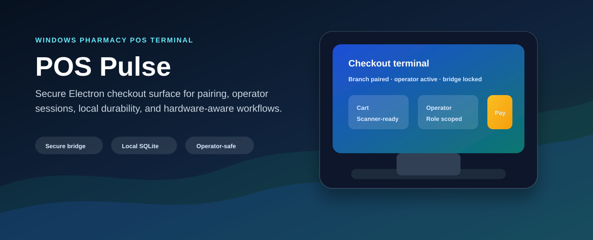
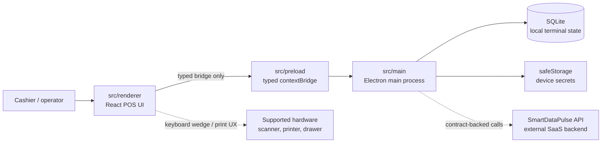

# POS Pulse

[](LICENSE)
[](.nvmrc)
[](package-lock.json)
[](tsconfig.json)
[](package.json)
[](src/renderer)
[](docs/assets/badges/loc.svg)

POS Pulse is the Windows desktop point-of-sale terminal for the SmartDataPulse
pharmacy platform. This repository owns the Electron app surface: secure main,
preload, and renderer processes; local SQLite state; terminal pairing;
operator sessions; hardware-facing UX; and the typed bridge that connects the
cashier experience to trusted local capabilities.

The backend SaaS platform lives outside this repository. POS Pulse consumes its
contracts and keeps local terminal behavior secure, observable, and offline
aware.



## Why POS Pulse

Pharmacy checkout needs a terminal that feels fast to cashiers and boringly
safe to operators. POS Pulse keeps high-trust work in the Electron main process,
keeps the renderer behind a typed preload bridge, and treats local terminal
state as operationally important rather than incidental UI cache.

| Capability | What it protects |
| --- | --- |
|  Secure Electron boundary | `contextIsolation`, sandboxing, and typed preload IPC keep renderer code away from Node APIs. |
|  Terminal pairing | Device identity and branch scope are established through explicit pairing flows. |
|  Operator sessions | Cashier, manager, and admin access is enforced through local session and role surfaces. |
|  Local durability | SQLite migrations preserve terminal state and audit/event records predictably. |
|  Audit and redaction | Logs and audit events avoid PII, cards, secrets, and unsafe payloads. |
|  Hardware discipline | MVP support is intentionally narrow: Windows x64, keyboard-wedge scanners, receipt printers, and optional cash drawers. |

## Terminal Architecture

POS Pulse is an Electron 40 + React 19 + Vite 8 application. The app is split
across the Electron main process, a typed preload bridge, the renderer, local
SQLite, and generated API types from the SmartDataPulse platform contract.





## Repository Map

| Path | Purpose |
| --- | --- |
| `src/main` | Electron main process, SQLite access, pairing, audit, logging, operator lifecycle, secrets, IPC handlers, and observability. |
| `src/preload` | Typed preload bridge exposed through `contextBridge`. |
| `src/renderer` | React + Vite renderer, shell, routes, UI primitives, operator surfaces, and design tokens. |
| `src/shared` | Shared types, money utilities, audit schemas, bridge contracts, pairing types, and operator role definitions. |
| `migrations` | Versioned SQLite migration files applied by the local migration runner. |
| `tests` | Unit and integration coverage outside process-local source test folders. |
| `specs` | Spec Kit artifacts for foundation, terminal pairing, POS shell, and operator sessions. |
| `docs` | Documentation index, hardware matrix, and presentation assets. |

## What This Repo Owns

- Windows 10/11 x64 Electron POS terminal.
- Secure Electron process boundaries and typed preload bridge.
- Local SQLite migrations and terminal state.
- Pairing, operator session, audit, logging, and renderer shell surfaces.
- POS UI primitives, routes, and design tokens.
- Hardware compatibility documentation for the MVP scope.

## What This Repo Does Not Own

- The SmartDataPulse SaaS backend.
- Backend OpenAPI source-of-truth contracts.
- Dashboard/admin web application code.
- Broad hardware compatibility outside the constitution-approved MVP matrix.
- PCI card-terminal integration or direct card capture.

## Tech Stack

| Layer | Stack |
| --- | --- |
| Desktop runtime | Electron 40, Windows 10/11 x64 target |
| Renderer | React 19, Vite 8, Tailwind 4 |
| Language | TypeScript 5 strict mode |
| Local data | better-sqlite3, SQL migrations |
| Security | Electron sandbox, context isolation, typed preload bridge, safeStorage |
| Observability | pino, Sentry Electron |
| Testing | Vitest, Testing Library, happy-dom, axe-core |
| Packaging | electron-builder unsigned Windows directory build |

## Getting Started

### Prerequisites

- Node.js 20 or newer.
- npm with the committed `package-lock.json`.
- Windows 10/11 x64 for the target runtime and package dry-run.

### Install

```bash
npm install
```

### Run The App

```bash
npm run dev
```

The development command runs Vite and Electron together and opens the POS
terminal shell.

### Verify Locally

```bash
npm run typecheck
npm run lint
npm test
npm run package:dir
```

### Codegen

```bash
npm run codegen:api
npm run codegen:verify
```

The codegen flow uses the pinned OpenAPI snapshot unless a later feature moves
the project to a live contract source.

## Active Work

The active feature is `specs/004-operator-session`, which covers operator
identity, role visibility, session lifecycle, and local unlock behavior. Earlier
features established the Electron foundation, terminal pairing, and POS shell.

## Documentation

- [Documentation index](docs/README.md)
- [Hardware matrix](docs/hardware-matrix.md)
- [Foundation quickstart](specs/001-foundation/quickstart.md)
- [Terminal pairing quickstart](specs/002-terminal-pairing/quickstart.md)
- [POS shell plan](specs/003-pos-ui-shell/plan.md)
- [Operator session spec](specs/004-operator-session/spec.md)
- [Operator bridge contract](specs/004-operator-session/contracts/bridge-api.md)
- [Pull request template](.github/pull_request_template.md)

## Development Agreement

POS Pulse follows the project constitution and Spec Kit workflow. Keep changes
thin, test first, preserve secure Electron boundaries, avoid unsafe logging, and
do not change dependency manifests, lockfiles, migrations, or security posture
without explicit approval.
