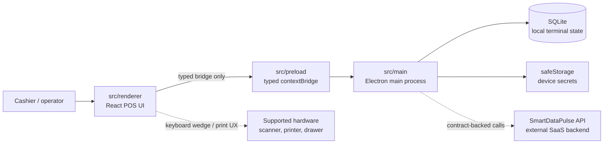

<div align="center">

# POS Pulse

**The Windows desktop POS terminal for the SmartDataPulse pharmacy platform.**

[](LICENSE)
[](.nvmrc)
[](tsconfig.json)
[](package.json)
[](src/renderer)
[](vite.config.ts)
[](tailwind.config.ts)
[](docs/assets/badges/loc.svg)


</div>

---

## Why this exists

Pharmacy checkout needs a terminal that feels fast to cashiers and boringly safe to operators. **POS Pulse keeps high-trust work in the Electron main process, keeps the renderer behind a typed preload bridge, and treats local terminal state as operationally important — not incidental UI cache.**

The backend SaaS platform lives outside this repository. POS Pulse consumes its contracts and keeps local terminal behavior secure, observable, and offline aware.

> **Success metric.** A cashier completes a sale, prints a receipt, and opens the drawer in under 10 seconds — with every transaction durably recorded and attributable to a named operator at a specific terminal, regardless of network state.

---

## Capabilities

<table>
<tr>
<td width="33%" align="center" valign="top">
  <br/>
  <strong>Secure Electron boundary</strong><br/>
  <sub><code>contextIsolation</code>, sandboxing, and a typed preload bridge keep renderer code away from Node APIs.</sub>
</td>
<td width="33%" align="center" valign="top">
  <br/>
  <strong>Terminal pairing</strong><br/>
  <sub>Device identity and branch scope are established through explicit pairing flows.</sub>
</td>
<td width="33%" align="center" valign="top">
  <br/>
  <strong>Operator sessions</strong><br/>
  <sub>Cashier, manager, and admin access is enforced through local session and role surfaces.</sub>
</td>
</tr>
<tr>
<td align="center" valign="top">
  <br/>
  <strong>Local durability</strong><br/>
  <sub>SQLite migrations preserve terminal state and audit/event records predictably.</sub>
</td>
<td align="center" valign="top">
  <br/>
  <strong>Audit &amp; redaction</strong><br/>
  <sub>Logs and audit events avoid PII, cards, secrets, and unsafe payloads.</sub>
</td>
<td align="center" valign="top">
  <br/>
  <strong>Hardware discipline</strong><br/>
  <sub>Windows x64, keyboard-wedge scanners, receipt printers, and optional cash drawers — intentionally narrow.</sub>
</td>
</tr>
</table>

---

## Terminal architecture

POS Pulse is an Electron 40 + React 19 + Vite 8 application. The app is split across the Electron main process, a typed preload bridge, the renderer, local SQLite, and generated API types from the SmartDataPulse platform contract.




---

## End-to-end transaction flow

A sale travels through every process boundary — and never crosses one without a contract.


| Step | Lane | What happens |
| :--: | --- | --- |
| **1** | Renderer | Cashier scans an SKU; React cart state updates in minor-unit money. |
| **2** | Preload | The typed `contextBridge` contract validates the call payload. |
| **3** | Main | Zod + money invariants check the transaction before any state mutates. |
| **4** | Main | A redacted audit event is composed — PII, card, and secret fields are stripped. |
| **5** | SQLite | The transactional migration runner commits the sale and the audit event together. |
| **6** | SaaS | Online? An idempotent, contract-backed sync hands the receipt off to the platform. |

---

## Repository map

| Path | Purpose |
| --- | --- |
| `src/main` | Electron main process · SQLite access · pairing · audit · logging · operator lifecycle · secrets · IPC handlers · observability |
| `src/preload` | Typed preload bridge exposed through `contextBridge` |
| `src/renderer` | React + Vite renderer · shell · routes · UI primitives · operator surfaces · design tokens |
| `src/shared` | Shared types · money utilities · audit schemas · bridge contracts · pairing types · operator roles |
| `migrations` | Versioned SQLite migration files applied by the local migration runner |
| `tests` | Unit and integration coverage outside process-local source test folders |
| `specs` | Spec Kit artifacts for foundation, pairing, POS shell, operator sessions, sales, payments, visual system |
| `docs` | Documentation index · hardware matrix · product · design system · assets |

### What this repo owns
Windows 10/11 x64 Electron POS terminal · secure process boundaries · typed preload bridge · local SQLite migrations and terminal state · pairing, operator session, audit, logging, renderer shell · POS UI primitives, routes, and design tokens · MVP hardware compatibility docs.

### What this repo does **not** own
SmartDataPulse SaaS backend · backend OpenAPI source-of-truth · dashboard/admin web app · broad hardware compatibility outside the MVP matrix · PCI card-terminal integration or direct card capture.

---

## Tech stack

| Layer | Stack |
| --- | --- |
| Desktop runtime | Electron 40 · Windows 10/11 x64 target |
| Renderer | React 19 · Vite 8 · Tailwind 4 |
| Language | TypeScript 5 strict mode |
| Local data | `better-sqlite3` · SQL migrations |
| Security | Electron sandbox · context isolation · typed preload bridge · `safeStorage` |
| Observability | pino · Sentry Electron |
| Testing | Vitest · Testing Library · happy-dom · axe-core |
| Packaging | electron-builder unsigned Windows directory build |

---

## Getting started

**Prerequisites.** Node.js 20+ · npm with the committed `package-lock.json` · Windows 10/11 x64 for the target runtime and package dry-run.

```bash
npm install            # install dependencies
npm run dev            # run Vite + Electron together
npm run typecheck      # both tsconfigs
npm run lint           # eslint + prettier --check
npm test               # vitest
npm run package:dir    # electron-builder --win --dir (unsigned)
```

**Codegen.** The codegen flow uses the pinned OpenAPI snapshot unless a later feature moves the project to a live contract source.

```bash
npm run codegen:api     # regenerate src/shared/api-types.ts
npm run codegen:verify  # CI helper: regen → diff
```

---

## Active work

The active feature is `specs/007-pos-visual-system`, which covers the visual system that lights up across pairing, terminal-state, and operator surfaces. Earlier features established the Electron foundation, terminal pairing, POS shell, operator sessions, sales cart, and payments tender.

---

## Documentation

| Audience | First reads |
| --- | --- |
| **Product & operations** | [Product brief](docs/product.md) · [Hardware matrix](docs/hardware-matrix.md) · [POS shell spec](specs/003-pos-ui-shell/spec.md) |
| **Engineering** | [Foundation quickstart](specs/001-foundation/quickstart.md) · [Pairing quickstart](specs/002-terminal-pairing/quickstart.md) · [Operator session plan](specs/004-operator-session/plan.md) |
| **Design** | [Design system tokens](docs/design-system.md) · [Visual system spec](specs/007-pos-visual-system/spec.md) |
| **Security** | [Constitution](.specify/memory/constitution.md) · [Operator security review](specs/004-operator-session/security-review/s1-review.md) |
| **Integration** | [Pairing HTTP contract](specs/002-terminal-pairing/contracts/pairing-http.md) · [Operator bridge contract](specs/004-operator-session/contracts/bridge-api.md) · [API snapshot](scripts/openapi-snapshot.json) |

Full navigation lives in [docs/README.md](docs/README.md).

---

## Development agreement

POS Pulse follows the project constitution and Spec Kit workflow. Keep changes thin, test first, preserve secure Electron boundaries, avoid unsafe logging, and do not change dependency manifests, lockfiles, migrations, or security posture without explicit approval.

<div align="center">
<sub>Precise · accountable · unhurried.</sub>
</div>
