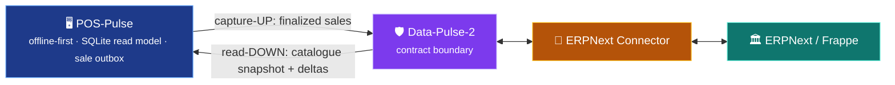

# Synchronization — POS-Pulse in Retail Tower OS

> How the terminal stays in sync with the platform — and why it never talks to ERPNext directly.

<p align="center">
  
</p>

POS-Pulse is the **edge** of the Retail Tower OS pipeline. It speaks **only** to
`Data-Pulse-2`'s contracts — never to ERPNext.

```text
POS-Pulse ──▶ Data-Pulse-2 ──▶ ERPNext Connector ──▶ ERPNext / Frappe
```

## Two directions

| Direction | What moves | For the terminal |
|---|---|---|
| 🔵 **Read-DOWN** | Resolved sellable catalogue snapshot + deltas | A scanned barcode resolves to a real product **offline**, from the local SQLite read model |
| 🟠 **Capture-UP** | Finalized sales (via the local outbox) | A completed sale durably queues locally, then rises to the backend |



The cross-repo control plane and full program view live in the
[Retail-Tower-Orchestrator](https://github.com/ahmed-shaaban-94/Retail-Tower-Orchestrator).

> Architecture is stable; this document does not assert feature/merge status. See the repo's
> `specs/**` and `CLAUDE.md` for the authoritative implementation state.
